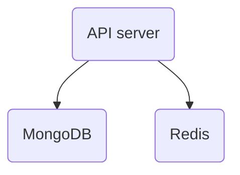

# Disaster Recovery

_NotifyBC_ consists of three runtime components with dependencies

Each runtime component is horizontally scalable to form a high-availability cluster. Such HA cluster is resilient to the failure of individual node.

Under disastrous circumstances, however, entire HA cluster may fail. Recovery should be performed in this order

1. MongoDB
2. Redis
3. API server

Notes

- MongoDB holds persistent data. When recovering MongoDB, data needs to be recovered. If data is corrupted, restore from backup.
- If MongoDB is the only failed component, after recovery, the other two components don't need to be restarted.
- Redis doesn't hold persistent data. When recovering Redis, data doesn't need to be recovered.
- After recovering Redis, API server needs to be restarted.
