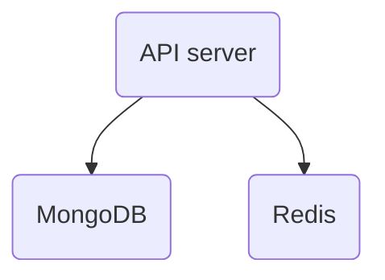

# Disaster Recovery

_NotifyBC_ consists of three runtime components

Each runtime component is horizontally scalable to form a high-availability cluster. Such HA cluster is resilient to the failure of individual node.

Under disastrous circumstances, however, entire HA cluster may fail. Recovery should be performed in this order

1. MongoDB
2. Redis
3. API server
